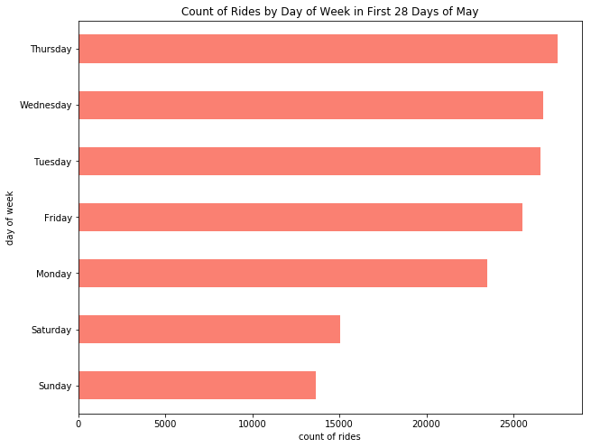
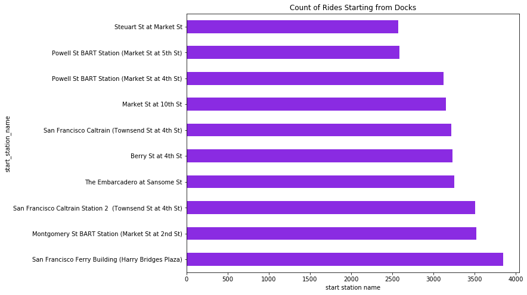
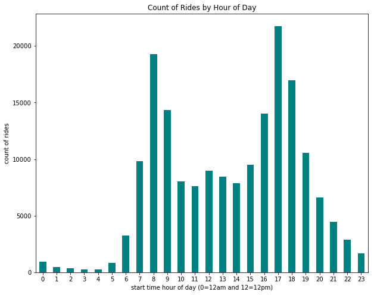

Title: Sample Project Start: Bay Area Bike Share Data
Slug: sample-project-msis-2629
Summary: 2018 summer MSIS 2629 sample bay area bike share data project
Date: 2018-06-24 17:00
Category: Teaching
PostType: Project
Tags: santa clara university
Keywords: sample project start msis 2629
Authors: Dan Friedman

### Thought Process


1. Construct hypotheses on questions I want answered about this dataset.
2. Understand the fields, values, and number of observations.
3. Clean only what's needed to answer one question.
4. Test your hypothesis by extracting metrics and visualizing results. Try prototyping simple visualizations in Pandas Plot.
5. Repeat steps 1-4 as many times as need to answer your questions
6. Incorporate a similar dataset for comparison to tell a more interesting story.
7. Improve upon your initial visualizations to include the additional dataset and/or tell a more interesting story. Ideally use a level of benchmarking and/or interaction in your visualizations.

### Hypotheses

Sorted from easiest to most difficult.

- What dataset?
- Regular vs subscription users
- Popularity of rides by day of week
- Busiest dock?
- Popularity of bike rides by hour of day
- Which routes are most popular?
- Average miles covered on weekdays versus weekend rides
- Any bicycles broken?


**New dataset**
- Trends with BART dataset? Usage of one type of rides versus the other

### Import Modules


```python
import pandas as pd
import numpy as np
from datetime import date
import matplotlib.pyplot as plt
%matplotlib inline
```

### Read in Data


```python
df = pd.read_csv('201805-fordgobike-trip-data.csv')
```

### Check Fields of Data


```python
df.info()
```

    <class 'pandas.core.frame.DataFrame'>
    RangeIndex: 179125 entries, 0 to 179124
    Data columns (total 16 columns):
    duration_sec               179125 non-null int64
    start_time                 179125 non-null object
    end_time                   179125 non-null object
    start_station_id           179125 non-null int64
    start_station_name         179125 non-null object
    start_station_latitude     179125 non-null float64
    start_station_longitude    179125 non-null float64
    end_station_id             179125 non-null int64
    end_station_name           179125 non-null object
    end_station_latitude       179125 non-null float64
    end_station_longitude      179125 non-null float64
    bike_id                    179125 non-null int64
    user_type                  179125 non-null object
    member_birth_year          167376 non-null float64
    member_gender              167413 non-null object
    bike_share_for_all_trip    179125 non-null object
    dtypes: float64(5), int64(4), object(7)
    memory usage: 21.9+ MB


### Regular versus subscription users

How many people are riding one-time (maybe tourists) versus how many are subscription paying users?

Look at field `user_type`


```python
df['user_type'].value_counts()
```


    Subscriber    149886
    Customer       29239
    Name: user_type, dtype: int64


#### Insight 

**Far majority of rides come from subscribers**

### Examine Rides by Day of Week

Convert `start_time` to datetime type and create new column called `start_time_datetime`.

Documentation: http://pandas.pydata.org/pandas-docs/stable/generated/pandas.to_datetime.html


```python
df['start_time_datetime'] = pd.to_datetime(df['start_time'])
```

Create a new column called `start_time_day_name` to show day name like Thursday or Friday.

Documentation: http://pandas.pydata.org/pandas-docs/version/0.22/generated/pandas.Series.dt.weekday_name.html


```python
df['start_time_day_name'] = df['start_time_datetime'].dt.weekday_name
```

Check we only have 7 unique values.

Documentation: https://pandas.pydata.org/pandas-docs/version/0.23.1/generated/pandas.Series.unique.html


```python
df['start_time_day_name'].unique()
```


    array(['Thursday', 'Wednesday', 'Tuesday', 'Monday', 'Sunday', 'Saturday',
           'Friday'], dtype=object)


Keep records of rides only before May 29th so we have the same number of occurrences for all days of the week. 


```python
may_29_2018 = date(2018, 5, 29)
```

Let's filter by rides before May 29th and get the total count of rides on each day.

Documentation date filters: https://stackoverflow.com/a/41845355/1710454

Documentation groupby: https://pandas.pydata.org/pandas-docs/stable/generated/pandas.DataFrame.groupby.html

Documentation size: https://pandas.pydata.org/pandas-docs/version/0.22/generated/pandas.core.groupby.GroupBy.size.html


```python
df[df['start_time_datetime']<may_29_2018].groupby(by='start_time_day_name').size()
```


    start_time_day_name
    Friday       25512
    Monday       23510
    Saturday     15035
    Sunday       13644
    Thursday     27542
    Tuesday      26528
    Wednesday    26705
    dtype: int64


Sort series values from least to greatest.

Documentation: https://pandas.pydata.org/pandas-docs/stable/generated/pandas.DataFrame.sort_values.html


```python
df[df['start_time_datetime']<may_29_2018].groupby(by='start_time_day_name').size().sort_values()
```


    start_time_day_name
    Sunday       13644
    Saturday     15035
    Monday       23510
    Friday       25512
    Tuesday      26528
    Wednesday    26705
    Thursday     27542
    dtype: int64


Create bar plot of count of rides by day of week.


```python
df[df['start_time_datetime']<may_29_2018].groupby(by='start_time_day_name').size().sort_values().plot(kind='barh', figsize=(10, 8), color='salmon')
plt.ylabel("day of week")
plt.xlabel("count of rides")
plt.title("Count of Rides by Day of Week in First 28 Days of May");
```





#### Insights 

**There's a fairly uniform spread of total rides from Monday-Friday, each with about 25000 rides.**

**There's a uniform spread of rides on Saturdays and Sundays too. Each day had roughly 14000 rides in May.**

### Busiest Dock

After each ride, bikes are docked at a station. I want to get a sense of the most popular stations bikes start at.


```python
df.groupby('start_station_name').size().sort_values(ascending=False).head(10)
```


    start_station_name
    San Francisco Ferry Building (Harry Bridges Plaza)           3851
    Montgomery St BART Station (Market St at 2nd St)             3523
    San Francisco Caltrain Station 2  (Townsend St at 4th St)    3510
    The Embarcadero at Sansome St                                3255
    Berry St at 4th St                                           3236
    San Francisco Caltrain (Townsend St at 4th St)               3220
    Market St at 10th St                                         3154
    Powell St BART Station (Market St at 4th St)                 3122
    Powell St BART Station (Market St at 5th St)                 2590
    Steuart St at Market St                                      2575
    dtype: int64


```python
df.groupby('start_station_name').size().sort_values(ascending=False).head(10).plot(kind='barh', color='blueviolet', figsize=(10, 8))                                                                          
plt.xlabel("count of rides")
plt.xlabel("start station name")
plt.title("Count of Rides Starting from Docks");
```





#### Insights

**Most rides start from docks located in SoMa - often around BART, Caltrain or popular tourist destinations like the Ferry Building.**

### Bike Ride Popularity by Hour of Day

Extract the hour value of the datetime and cast it as new column called `start_time_hour`.

Documentation: http://pandas.pydata.org/pandas-docs/version/0.23/generated/pandas.Series.dt.hour.html


```python
df['start_time_hour'] = df['start_time_datetime'].dt.hour
```

Verify there's 24 unique values in `start_time_hour` - should be 0 to 23.


```python
df['start_time_hour'].unique()
```


    array([21, 18, 14, 16, 23, 20, 22, 19, 17, 12, 11,  9,  8, 13, 15, 10,  7,
            6,  5,  4,  3,  2,  1,  0])


```python
df.groupby('start_time_hour').size().plot(kind='bar', figsize=(10, 8), color='teal')
plt.ylabel("count of rides")
plt.xticks(rotation=0)
plt.xlabel("start time hour of day (0=12am and 12=12pm)")
plt.title("Count of Rides by Hour of Day");
```





#### Insights

**Most rides take place during standard work commute hours of 8am and 6pm. It's a bimodal distribution.**

### Next Steps

- Hone in the hypotheses to a more focused topic - perhaps around just subscribers versus one-time riders, activity of males versus females, rides by weekends versus weekdays, or something else.
- Incorporate additional dataset on ride patterns with BART data or open source weather data.
- Try utilizing more advanced/interesting visualizations to tell a story.
