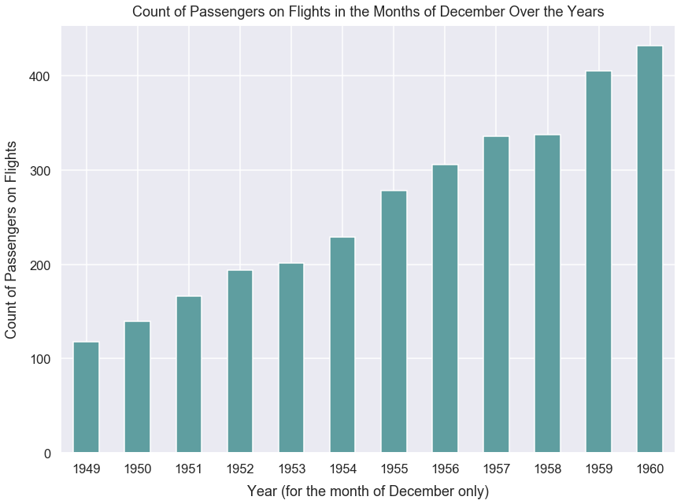
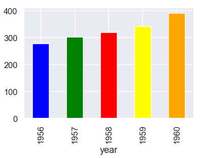
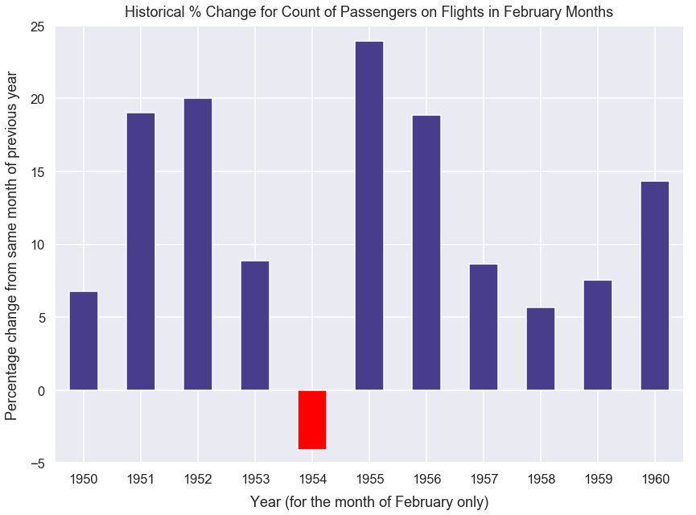

Title: Sample Learning Exercise 0 with Answers
Slug: sample-learning-exercise-0-answers
Summary: Sample learning class exercise given as practice to take home with answers included
Date: 2018-07-23 12:00  
Category: Teaching
PostType: Answer Guide
Tags: line plot, benchmarking
Keywords: learning exercise 0
Authors: Dan Friedman

### Import Modules


```python
import pandas as pd
import numpy as np
import seaborn as sns
import matplotlib.pyplot as plt
% matplotlib inline
```

#### Set Visualization Styles


```python
sns.set_context("talk")
sns.set_style("darkgrid")
```

### Grading Rubric

Creation of visualizations are each worth 3 points. All other questions are 1 point each. It's possible to get partial-credit on the visualizations if you present work close to the best answer.

### Flights Dataset

This dataset includes the total count of passengers on airline flights for each month from 1949 to 1960.

### Question 1: Read in dataset using Seaborn and assign to variable

You can use this code snippet to read in the dataset: `sns.load_dataset('flights')`


```python
df = sns.load_dataset('flights')
```

### Question 2: How many records/rows are in this dataset?

Please programatically print the value.


```python
len(df)
```


    144


### Print a DataFrame of 3 columns: year, month and count of passengers but *only* for the months of December

You will need filter the DataFrame to just view rows where a condition is met (month is equal to December). You can learn how to do that on <a href='https://chrisalbon.com/python/data_wrangling/filter_dataframes/' rel='nofollow'>Chris Albon's tutorial</a>.


```python
df[df['month']=='December']
```


<div>
<table border="1" class="dataframe">
  <thead>
    <tr style="text-align: right;">
      <th></th>
      <th>year</th>
      <th>month</th>
      <th>passengers</th>
    </tr>
  </thead>
  <tbody>
    <tr>
      <th>11</th>
      <td>1949</td>
      <td>December</td>
      <td>118</td>
    </tr>
    <tr>
      <th>23</th>
      <td>1950</td>
      <td>December</td>
      <td>140</td>
    </tr>
    <tr>
      <th>35</th>
      <td>1951</td>
      <td>December</td>
      <td>166</td>
    </tr>
    <tr>
      <th>47</th>
      <td>1952</td>
      <td>December</td>
      <td>194</td>
    </tr>
    <tr>
      <th>59</th>
      <td>1953</td>
      <td>December</td>
      <td>201</td>
    </tr>
    <tr>
      <th>71</th>
      <td>1954</td>
      <td>December</td>
      <td>229</td>
    </tr>
    <tr>
      <th>83</th>
      <td>1955</td>
      <td>December</td>
      <td>278</td>
    </tr>
    <tr>
      <th>95</th>
      <td>1956</td>
      <td>December</td>
      <td>306</td>
    </tr>
    <tr>
      <th>107</th>
      <td>1957</td>
      <td>December</td>
      <td>336</td>
    </tr>
    <tr>
      <th>119</th>
      <td>1958</td>
      <td>December</td>
      <td>337</td>
    </tr>
    <tr>
      <th>131</th>
      <td>1959</td>
      <td>December</td>
      <td>405</td>
    </tr>
    <tr>
      <th>143</th>
      <td>1960</td>
      <td>December</td>
      <td>432</td>
    </tr>
  </tbody>
</table>
</div>


### Plot the count of passengers on the flights in December (of each year) over time

- This should be a bar graph because each year's December count of passengers essentially represents a summed-up or total value of all passengers. (Alternatively, it could be a line plot but I prefer bar plots for this situation.)
- x-axis ticks each represent December for a specific year
- on the x-axis, years should progress from left to right in increasing order from 1949 to 1960
- y-axis should be the count of passengers for flights
- please make the figure size larger than the default
- please provide a proper label for the title, x-label and y-label
- please make the font larger for default on the x-ticks, y-ticks, x-label, y-label and title so it's more easily readable
- change the color of the bars to a different dark color (not the default blue)

Hint: you can use Pandas Plot from the <a href='https://pandas.pydata.org/pandas-docs/stable/generated/pandas.DataFrame.plot.html' rel='nofollow'>documentation at this page</a>. Use the `kind` argument to pass in a value of `bar`.

Hint: if you use Matplotlib, Pandas Plot or Seaborn, you can use `sns.set_context("poster")` or `sns.set_context('talk')` to make *nearly all* parts of the plot larger. See the <a href='https://seaborn.pydata.org/tutorial/aesthetics.html' rel='nofollow'>documentation here</a>.

Hint: you can see available colors for bars at <a href='https://matplotlib.org/examples/color/named_colors.html' rel='nofollow'>this documentation page</a>. 


```python
df[df['month']=='December'].set_index('year')['passengers'].plot(kind='bar', color='cadetblue', figsize=(14, 10), rot=0)
plt.xlabel("Year (for the month of December only)", labelpad=12)
plt.ylabel("Count of Passengers on Flights", labelpad=12)
plt.title("Count of Passengers on Flights in the Months of December Over the Years", y=1.01);
```





### Based on the plot above, how would you describe the trend of count of passengers on flights in the month of December over time?

With every increasing year from 1949 to 1960, there is an increasing number of passengers on flights.

### Based on looking at the plot above, which year had the most number of passengers on flights for the month of December? How many passengers were on all flights then?


```python
df[df['month']=='December'].sort_values(by='passengers', ascending=False).iloc[0]
```


    year              1960
    month         December
    passengers         432
    Name: 143, dtype: object


1960 with 432 passengers.

### Given your original DataFrame, create a new column that's the percent change year over year for *specific months*

The count of passengers for flights in December of 1949 is 118 and the count of passengers for flights in December of 1950 is 140. Therefore, the % change for count of passengers from the previous year's  same-month value is:

(140-118)/140*100 = 18.65

You can read more about this metric <a href='https://www.mathsisfun.com/numbers/percentage-change.html' rel='nofollow'>here</a>: 

Hint: you can use the `pct_change()` method in Pandas. You'll have to use the `periods` argument and set in a new value from the default. If you're not sure you used `pct_change()` correctly, you can compare the value above, 18.65%, with the value you see in your new column for December of 1950.


```python
df['passengers_yearly_month_pct_change'] = df['passengers'].pct_change(periods=12)*100
```


```python
df[df['month']=='December']
```


<div>
<table border="1" class="dataframe">
  <thead>
    <tr style="text-align: right;">
      <th></th>
      <th>year</th>
      <th>month</th>
      <th>passengers</th>
      <th>passengers_yearly_month_pct_change</th>
    </tr>
  </thead>
  <tbody>
    <tr>
      <th>11</th>
      <td>1949</td>
      <td>December</td>
      <td>118</td>
      <td>NaN</td>
    </tr>
    <tr>
      <th>23</th>
      <td>1950</td>
      <td>December</td>
      <td>140</td>
      <td>18.644068</td>
    </tr>
    <tr>
      <th>35</th>
      <td>1951</td>
      <td>December</td>
      <td>166</td>
      <td>18.571429</td>
    </tr>
    <tr>
      <th>47</th>
      <td>1952</td>
      <td>December</td>
      <td>194</td>
      <td>16.867470</td>
    </tr>
    <tr>
      <th>59</th>
      <td>1953</td>
      <td>December</td>
      <td>201</td>
      <td>3.608247</td>
    </tr>
    <tr>
      <th>71</th>
      <td>1954</td>
      <td>December</td>
      <td>229</td>
      <td>13.930348</td>
    </tr>
    <tr>
      <th>83</th>
      <td>1955</td>
      <td>December</td>
      <td>278</td>
      <td>21.397380</td>
    </tr>
    <tr>
      <th>95</th>
      <td>1956</td>
      <td>December</td>
      <td>306</td>
      <td>10.071942</td>
    </tr>
    <tr>
      <th>107</th>
      <td>1957</td>
      <td>December</td>
      <td>336</td>
      <td>9.803922</td>
    </tr>
    <tr>
      <th>119</th>
      <td>1958</td>
      <td>December</td>
      <td>337</td>
      <td>0.297619</td>
    </tr>
    <tr>
      <th>131</th>
      <td>1959</td>
      <td>December</td>
      <td>405</td>
      <td>20.178042</td>
    </tr>
    <tr>
      <th>143</th>
      <td>1960</td>
      <td>December</td>
      <td>432</td>
      <td>6.666667</td>
    </tr>
  </tbody>
</table>
</div>


### Plot the `pct_change_increase` column over time for the months of February. % change values > 0 should be a dark blue and % change values < 0 should be red (to denote negative)

- Should be a bar plot. (Alternatively, you could just put a horizontal line to represent the % change values rather than a bar - but I find a shaded bar easier to see on a plot.)
- x-axis ticks each represent the months of February over all years provided in the dataset
- on the x-axis, years should progress from left to right in increasing order from 1949 to 1960
- y-axis should be % change value from the column `pct_change_increase` 
- please provide a proper label for the title, x-label and y-label
- please make the figure size larger
- please make the font larger for default on the x-ticks, y-ticks, x-label, y-label and title so it's more easily readable
- for `pct_change_increase` values greater than 0, please make the bar colors a dark blue, and for bar colors less than 0, please make them red.* (explanation below)
- only show years 1950 to 1960 (not 1949) because we have no numerical value for 1949.


Hint: you can use Pandas Plot from the documentation at <a href='https://pandas.pydata.org/pandas-docs/stable/generated/pandas.DataFrame.plot.html' rel='nofollow'>. this page</a>. You should use the `kind` argument to pass in a value of `bar`.

Hint: if you use Matplotlib, Pandas Plot or Seaborn, you can use `sns.set_context("poster")` to make all parts of the plot larger.

Hint: you can see available colors for bars on <a href='https://matplotlib.org/examples/color/named_colors.html' rel='nofollow'>this documentation page</a>. 

#### Hint: how to change bar colors

Pandas Plot has an argument for `color`. You could pass a single value like `red` or a list of values. Hypothetically, let's say you had a bar plot with 3 bars. If you pass 3 colors to the `color` argument such as `['blue', 'red', 'blue']`, the 1st and 3rd bars will be blue and the middle bar will be red. We can use similar logic for our plot below.

How do we get a list of colors like that for our plot below? First create an empty Python list to store our color values. For the `pct_change_increase` values in the month of February, we can assess if the value is greater than or less than 0. Loop over the `pct_change_increase` values; if it's greater than 0, append a value to your list of a dark blue color, otherwise append a value of red. Then, use that Python list as the value to the `color` argument in our plot method.

Hint: the initial code to loop over a field is simply `for value in df['column_name']:`

______________

##### Side Example: Various Colors in Pandas Plot 


```python
new_colors = ['blue', 'green', 'red', 'yellow', 'orange']
```


```python
df[(df['month']=='February') & (df['year']>1955)].set_index('year')['passengers'].plot(kind='bar',
                                                                                      color=new_colors);
```





_________


```python
df[df['month']=='February']
```


<div>
<table border="1" class="dataframe">
  <thead>
    <tr style="text-align: right;">
      <th></th>
      <th>year</th>
      <th>month</th>
      <th>passengers</th>
      <th>passengers_yearly_month_pct_change</th>
    </tr>
  </thead>
  <tbody>
    <tr>
      <th>1</th>
      <td>1949</td>
      <td>February</td>
      <td>118</td>
      <td>NaN</td>
    </tr>
    <tr>
      <th>13</th>
      <td>1950</td>
      <td>February</td>
      <td>126</td>
      <td>6.779661</td>
    </tr>
    <tr>
      <th>25</th>
      <td>1951</td>
      <td>February</td>
      <td>150</td>
      <td>19.047619</td>
    </tr>
    <tr>
      <th>37</th>
      <td>1952</td>
      <td>February</td>
      <td>180</td>
      <td>20.000000</td>
    </tr>
    <tr>
      <th>49</th>
      <td>1953</td>
      <td>February</td>
      <td>196</td>
      <td>8.888889</td>
    </tr>
    <tr>
      <th>61</th>
      <td>1954</td>
      <td>February</td>
      <td>188</td>
      <td>-4.081633</td>
    </tr>
    <tr>
      <th>73</th>
      <td>1955</td>
      <td>February</td>
      <td>233</td>
      <td>23.936170</td>
    </tr>
    <tr>
      <th>85</th>
      <td>1956</td>
      <td>February</td>
      <td>277</td>
      <td>18.884120</td>
    </tr>
    <tr>
      <th>97</th>
      <td>1957</td>
      <td>February</td>
      <td>301</td>
      <td>8.664260</td>
    </tr>
    <tr>
      <th>109</th>
      <td>1958</td>
      <td>February</td>
      <td>318</td>
      <td>5.647841</td>
    </tr>
    <tr>
      <th>121</th>
      <td>1959</td>
      <td>February</td>
      <td>342</td>
      <td>7.547170</td>
    </tr>
    <tr>
      <th>133</th>
      <td>1960</td>
      <td>February</td>
      <td>391</td>
      <td>14.327485</td>
    </tr>
  </tbody>
</table>
</div>


```python
bar_colors = []

for pct_change in df[(df['month']=='February') & (df['year']>1949)]['passengers_yearly_month_pct_change']:
    if pct_change > 0:
        bar_color='darkslateblue'
    else:
        bar_color='red'
    bar_colors.append(bar_color)
```


```python
bar_colors
```


    ['darkslateblue',
     'darkslateblue',
     'darkslateblue',
     'darkslateblue',
     'red',
     'darkslateblue',
     'darkslateblue',
     'darkslateblue',
     'darkslateblue',
     'darkslateblue',
     'darkslateblue']


```python
df_feb = df[(df['month']=='February') & (df['year']>1949)]
```


```python
df_feb.set_index('year')['passengers_yearly_month_pct_change'].plot(kind='bar',
                                                                    figsize=(14, 10),
                                                                    ylim=(-5, 25),
                                                                    color=bar_colors,
                                                                    rot=0)
plt.xlabel("Year [February month data only]", labelpad=12)
plt.ylabel("Percentage change from same month of previous year", labelpad=12)
plt.title("Historical % Change for Count of Passengers on Flights in February Months", y=1.01);
```




